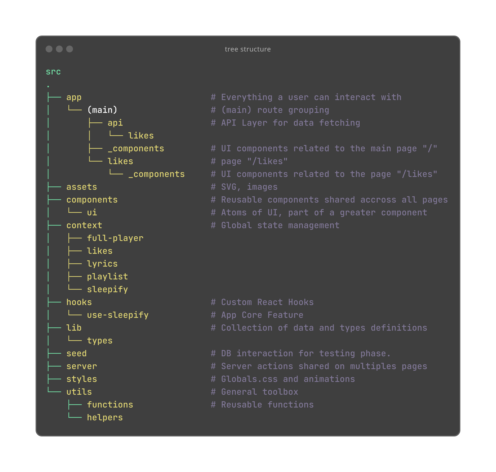

# Sleepify App

Remember when the internet was a chaotic wonderland, and streaming meant "buffering"? Sleepify is here to take you back while letting you live in 2024.

Think Spotify, but wrapped in a 90s aesthetic and dipped in neobrutalist vibes. Functional? Yes. Gorgeous? Sure. Ironic? You bet.

## Table of content

1. [Features](#features)
2. [Tech Stack](#tech-stack)
3. [Getting Started](#getting-started)
   - [Prerequisites](#prerequisites)
   - [Installation](#installation)
4. [Project Structure](#project-structure)
5. [Core Feature Description](#core-feature-description)
   - [useSleepifyState](#useSleepifyState)
   - [useSleepifyEffects](#useSleepifyEffects)
   - [useSleepifyPlayer](#useSleepifyPlayer)
   - [useSleepify](#useSleepify)
6. [Roadmap](#roadmap)
   - [Authentification](#authentification)
   - [useOptimistic](#useOptimistic)
7. [Contributing](#contributing)
8. [Tribute](#tribute)

## Features

With Sleepify, you can:

- Play, pause, and skip through playlists like it’s 1999 (but better).
- Precisely time-seek your favorite parts of the song
- Adjust the volume so your neighbor can enjoy your music better.
- Create and listen to your favorite playlists, curated by your superior taste.
- View the app from mobile (~320px) to desktop.
- Sing along to lyrics because you are the star of your own nostalgic sitcom.

## Tech Stack

With app was built using **NextJS15** and **React 19**.
The essentials include:

- TypeScript
- TailwindCSS
- Vercel Postgres
- Lucide-React
- Hosting: **Vercel**.

You can find the whole description out in package.json.
Take some time to skim through it before initialising the project.

**Heads up**: this is a _POC_ (Proof of Concept), so it’s intentionally minimal and snappy.
I try to not rely on external packages unless the need for it grows with the app.

## Getting Started

### Prerequisites

Before you start, make sure you meet the following requirement:

- `Node.js 18.18+`
- `pnpm 9+`

### Installation

1. `git clone git@github.com:Mokalbari/sleepify.git`
2. `cd sleepify`
3. `pnpm install`

**Big warning**: It won’t work out of the box. The database is hosted on Vercel.
You’ll need to email `rahoarau@gmail.com` to get your credentials.
(Yes, we gatekeep.)

When you are approved :

- Replace the `.env.sample` to `.env` and fill the fields with your credentials.
- `pnpm dev` and visit : `http://localhost:3000`

## Project Structure

This app uses NextJS 15 App Router with src directory.
Feeling lost? Here is a recap:

## Core Feature Description

At its core, Sleepify relies on three hooks in @/hooks/use-sleepify:

- useSleepifyState
- useSleepifyEffects
- useSleepifyPlayer

Each plays a key role in managing the app's music playback. Here’s a closer look:

### useSleepifyState

This hook acts as a state manager and is the backbone of Sleepify.
It tracks crucial aspects of the app like:

- The current track and playlist.
- The playback state (e.g., playing, paused).
- Volume levels and duration.

Under the hood, it uses useReducer for its great scalability and ease of maintenance.

### useSleepifyEffects

useSleepifyEffects is responsible for synchronizing the app’s state with the audio player.
By binding event listeners to the state, it ensures that changes in playback (like pausing or seeking) are reflected correctly.

### useSleepifyPlayer

This hook combines the functionality of useSleepifyState and useSleepifyAudio. It initializes the state and event listeners, acting as the app’s primary interface for playback.
It also provides a comprehensive toolbox for lower-level interactions with the audio player.

### useSleepify

Located in `@/context/sleepify`, this hook integrates the Sleepify logic into the app’s context.
It initializes the audio player reference (audioRef) and distributes state and methods across the app, ensuring seamless integration.

## Roadmap

Here’s what’s on the horizon (if I had 48 more hours and unlimited coffee):

### Authentification

- The test `USER_ID` is hardcoded everywhere.
- We can use NextAuth as it provides a simple and modern auth options

### useOptimistic

- Right now, the likes counter and like feature solely rely on the client. The state might fall out of sync with the server and there's no failsafe to handle it.
  To prevent this, we can use NextJS with React useOptimistic hook to rely on server.

## Contributing

Feeling inspired?
Fork this repo, make your changes, and submit a Pull Request.
Follow conventional commits, and we’re good to go.

Thanks for checking out Sleepify—because irony and nostalgia make everything better.

## Tribute

Wondering where the name Sleepify comes from? Check out [this video](https://www.youtube.com/watch?v=KXvncV79LXk) or [this wiki page](https://en.wikipedia.org/wiki/Sleepify) for more details.
